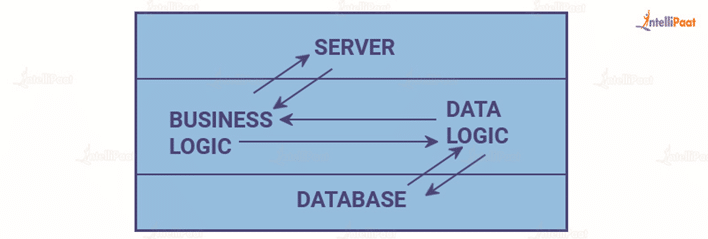
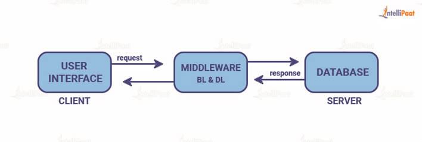

# Informe técnico

### Índice

1. [Análisis modelos de ejecución cliente/servidor](#análisis-modelos-de-ejecución-clienteservidor)
2. [Evaluación lenguajes de programación web utilizados](#evaluación-lenguajes-de-programación-web-utilizados)
3. [Problemas de compatibilidad entre navegadores](#problemas-de-compatibilidad-entre-navegadores)
4. [Análisis de los mecanismos de integración de los lenguajes de marcas con los lenguajes de programación de clientes web](#análisis-de-los-mecanismos-de-integración-de-los-lenguajes-de-marcas-con-los-lenguajes-de-programación-de-clientes-web)
5. [Evaluación de herramientas de programación para clientes web](#evaluación-de-herramientas-de-programación-para-clientes-web)

### Análisis modelos de ejecución cliente/servidor

El modelo cliente/servidor consiste en dos entidades: el cliente y el servidor. Siendo el cliente el que realiza 
solicitudes, mientras que el servidor se encarga de responder a estas solicitudes y proporcionar recursos o servicios,
existen 3 arquitecturas comunes dentro del modelo cliente/servidor:  
**Modelo cliente/servidor de 1 capa (1 tier)**  
Es una arquitectura donde todos los componentes necesarios para que funcione la aplicación se encuentran en la misma capa,
por lo que tanto la interfaz de usuario como la lógica de negocio y el acceso a datos se almacenan de manera local, puesto
que no hay separación entre cliente y servidor, las comunicaciones entre ambos son mas sencillas, además es simple de imlementar ,
especialmente en proyectos pequeños, sin embargo, la falta de separación de responsabilidades puede volverse difícil de 
escalar a medida que crecen las necesidades del sistema o aumenta la cantidad de usuarios.

    

 **Modelo cliente/servidor de 2 capas (2 tier)**  
 Es el modelo habitual, el cliente se comunica directamente con el servidor, la logica de la aplicación de divide en 2 partes 
 la interfaz de usuario en el lado del lciente y los datos que se procesan, en el servidor, un ejemplo de una aplicación 
 que siga esta arquitectura sería una aplicación paea gestionar las existencias del almacén de una tienda pequeña.
 

    

**Modelo cliente/servidor de 3 capas (3 Tier)**  
En este modelo, la lógica de nuestra app se divide en 3 capas: Interfaz de usuario, lógica de negocio y base de datos, 
es decir, que el cliente se conecta a un servidor que, a su vez, interactua con una base de datos, un ejemplo de una 
aplicación de este tipo sería una aplicación de un e-commerce donde, en el lado del cliente, muestra los productos y 
permite añadirlos al carrito para realizar pedidos, en la lógica de negocio tiene una API para gestionar los productos, 
usuarios y pedidos, así como gestionar pagos cconectandose a una API externa y por último, en el lado del a base de datos,
almacena los datos de los usuarios, los productos, las transacciones y los pedidos realizados

    

**Tabla comparativa resumen de los 2 modelos:**

|                         |             1 capa (1 tier)             |              2 capas (2 tier)              |                        3 capas (3 tier)                         |
|:-----------------------:|:---------------------------------------:|:------------------------------------------:|:---------------------------------------------------------------:|
|       Dificultad        |                  Baja                   |                    Baja                    |                              Media                              |
|      Escalabilidad      |              Muy limitada               |                  Limitada                  |                            Moderada                             |
|      Mantenimiento      |   Dificil debido a la logica acoplada   |        Centralizado en el servidor         | Facil(cada capa se puede mantener de manera independientemente) |
|        Latencia         | Baja ya que todo ocurre de manera local |   Baja debido a la comunicacion directa    |                            Moderada                             |
|           Uso           |      Aplicaciones pequeñas/locales      | Aplicaciones de negocios pequeñas/medianas |                 Aplicaciones Web empresariales                  |
| Coste de implementacion |        Bajo puesto que es local         |                   Medio                    |           alto ya que requiere mayor infraestructura            |

### Evaluación lenguajes de programación web utilizados
He decidido utilizar **Javascript con React** para mi propuesta debido a su caracter modular, ya que al usar componentes,
reutilizar estos en la aplicación haría el trabajo más comodo y eficiente además, al utilizar un DOM virtual mejora el
rendimiento de la aplicación, no todo es positivo a la hora de utilizar **Javasript con React**, ya que a medida que crezca 
mi aplicación, se me puede llegar a complicar la gestión de los estados además, ya que react está en constante desarrollo, 
esto me obligará a mantener la aplicación al día con las nuevas herramientas que se desarrollen en versiones más nuevas

### Problemas de compatibilidad entre navegadores
Los problemas de compatibilidad que me puedo llegar a encontrar entre navegadores son los siguientes:

**Validación de HTML y CSS** 
Puesto que cada navegador lee y gestiona de forma diferente el codigo que lee, por ejemplo, los pequeños errores que un
navegador puede que solucione automaticamente, llevandonos a que, en el navegador donde no se solvente solo este error, 
no se muestre la página tal y como se busca, para evitar este problema, la mejor decision que podemos tomar es utilizar 
validadores de CSS como **Jigsaw CSS Validator**.

**Falta de resets CSS** 
Cada navegador tiene sus propios presets de CSS y por tanto puede que algunos elementos que no se hayan modificado puesto
que no suponian un problema en el navegador donde se desarrolló, en otro navegador se muestren distintos, la solución
para este problema es usar una hoja de reset de estilos, sobreescribiendo asi los valores default de cada navegador.

**Problemas con JavaScript** 
Al utilizar funciones mordernas de Javascriot, es posible que en no todos los navegadores funcionen, debido a que la 
version de ECMAScript que utiliza cada navegador no tiene por qué ser la misma en todos, para evitar estos problemas,
lo que podemos hacer es, antes de usar un método novedoso, buscarlo en [Can I use...](https://caniuse.com/) para consultar
la compatibilidad de este.

### Análisis de los mecanismos de integración de los lenguajes de marcas con los lenguajes de programación de clientes web
Algunos de los mecanismos de integración de lenguajes de marcas con lenguajes de programacion son:

**El DOM (Document Object Model)** 
Es una interfaz de programación que representa la estructura de un domuento HMTL o XML como un árbol de elementos, a 
través del DOM, los lenguajes de programacion con Javascript pueden interactuar directamente con los elementos del documento
y modificarlos sin necesidad de recargar la página además, aparte de elementos, Javascript puede también gestionar eventos 
como clicks.

**Frameworks** 
Hay multitud de Frameworks y librerías que facilitan la integración de los lenguajes de marcas con los lenguajes de 
programación, como por ejemplo:

**React** 
Facilita la integración gracias a su **DOM virtual**, ya que permite que la manipulacón del DOM sea más eficiente, además, 
como react utiliza **JSX**, esto le permite escribir HTML dentro de Javascript, haciendo que la programación sea más
fluida.

**Vue** 
Como pasa con **React**, la manera de gestionarse mediante componentes de Vue facilita la interaccion entre el HTML y el 
Javascript, además los cambios en el modelo se muestran en el DOM y cualquier cambio en la interfaz de usuario también 
puede actualizar el modelo, por último, vue también utiliza plantillas que le permiten mezclar Javascript con HTML. 

**JQuery** 
Aunque ya no es tan popular como hace años, jquery también facilita la integración ya que simplifica el DOM, facilitando 
la selección y manipulación de elementos de este sin pasa por el **DOM nativo**, además facilita la gestión de eventos y 
la creación de animaciones y efectos.

### Evaluación de herramientas de programación para clientes web
Hoy en día existen bastantes herramientas para la programación de clientes web, algunas de ellas son:

**VSCode** 
Es un editor de código ligero y muy extensible con soporte para multitud de lenguajes y tecnologias e integracion con 
herramientas de control de versiones, además tiene una interfaz muy intuitiva y muy personalizable

**Chrome Dev Tools** 
Son un conjunto de herramientas para el desarrollo web y el debugeo que vienen integradas en Google Chrome,  estas 
herramientas nos permiten **debugear Javascript, manipular CSS y analizar el rendimiento de nuestra web**, todo esto en el 
entorno del navegador además incluye herramientas para controlar las peticiones **HTTP**, ver la actividad web  y 
optimizar la carga de recursos, gracias a esto, podemos identificar los recursos uqe cargan lento, minimizar la latencia
y mejorar el rendimiento general de nuestra web.

**Github** 
Es una plataforma que nos permite almacenar, gestionar y colaborar en proyectos de software utilizando **Git**, Github
nos ofrece funciones como **pull requests** y **revisiones de código** al colaborar con otros desarrolladores además, 
Github ofrece todo esto gratis, aunque tiene planes de pago en los que dispones de mas funciones como, espacios para 
programar nativos dentro del mismo Github.

**Node package manager** 
Es un gestor de paquetes para Javascript, este ofrece un gran ecosistema de librerias y herramientas de código abierto 
que permiten agilizar el proceso de desarrollo, esta herramienta ofrece un plan gratis con acceso ilimitado a paquetes
públicos aunque también existen planes de pago que ofrecen funcionalidades extra como paquetes privados ilimitados y 
control de acceso basado en roles.

### Bibliografía
[What is Client-Server arquitecture?](https://intellipaat.com/blog/what-is-client-server-architecture/#no6) 
[Todo sobre la arquitectura cliente-servidor](https://www.arsys.es/blog/todo-sobre-la-arquitectura-cliente-servidor) 
[Markdown table generator](https://www.tablesgenerator.com/markdown_tables) 
[Arquitectura Cliente/Servidor: modelo de 3 capas](https://iberasync.es/arquitectura-cliente-servidor-modelo-de-3-capas/) 
[Advantages and Disadvantages of React JS](https://medium.com/@reactmasters.in/advantages-and-disadvantages-of-react-js-e6c80b25763b) 
[Formas de evitar los problemas de compatibilidad multi navegador](https://comparium.app/es/blog/cross-browser-compatibility-issues/) 
[Comparing the technical strengths, weaknesses and use cases of the most popular JS frameworks and libraries](https://kruschecompany.com/ember-jquery-angular-react-vue-what-to-choose/) 
[10 best Web development tools to optimize your workflow](https://www.intelivita.com/au/blog/web-development-tools/)
[NPM pricing](https://www.npmjs.com/products)